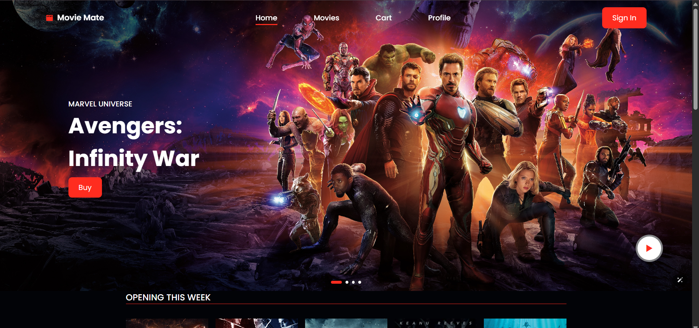
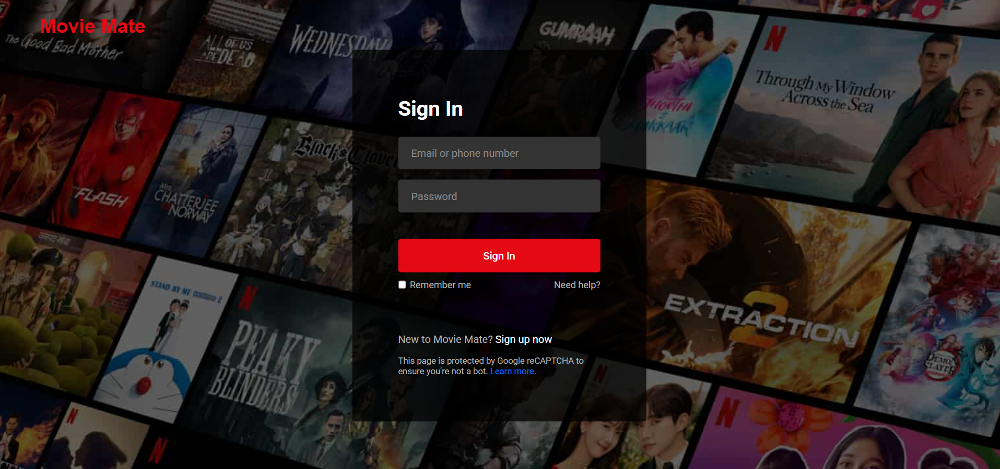
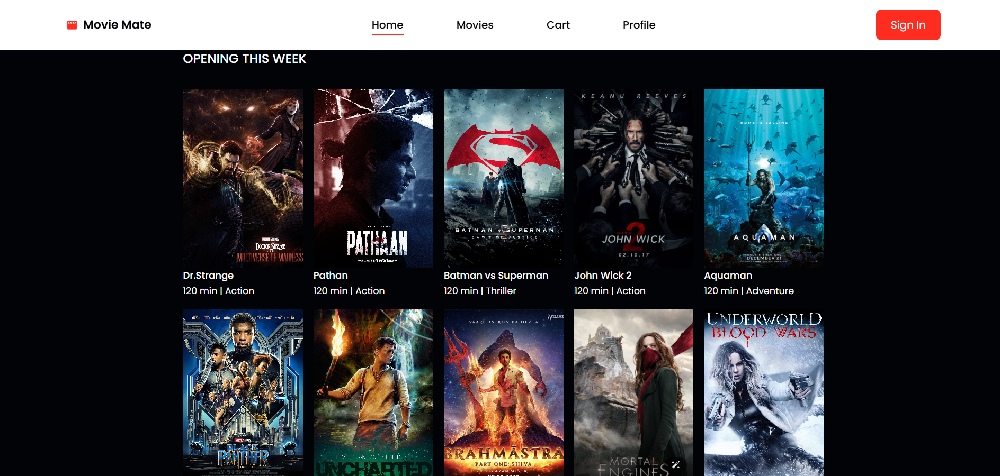
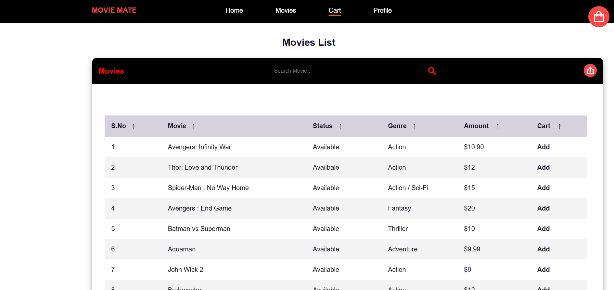
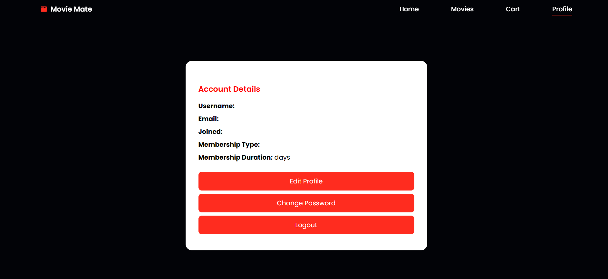

# 🎬 Movie Mate

**Movie Mate** is a responsive movie ticket booking web application.  
It allows users to browse movies, sign up, log in, manage their profiles, add tickets to the cart, and export movie data in multiple formats.  

---
<p align="center">
  
</p>
---

## 🧱 Tech Stack  

  
  
  
  
  
  
  

## ✨ Features

- 🔐 **User Authentication** (Sign Up / Sign In)  
- 🎥 **Movie Showcase** (Now Showing & Coming Soon)  
- 🛒 **Cart Functionality** with total price calculation  
- 👤 **User Profile & Membership Info**  
- 📊 **Exportable Movie Table** (PDF, CSV, Excel)  
- 📱 **Responsive Design** with SwiperJS & Boxicons  

---

## 📸 Screenshots  

|  |  |  |
|------------------------------------------|--------------------------------------------|-------------------------------------------|
|     |  |  |

---

## ⚙️ Installation & Setup  

### 1️⃣ Clone the Repository  
```bash
git clone https://github.com/your-username/moviemate.git
cd moviemate
```

### 2️⃣ Setup MySQL Database

1. Start XAMPP (Apache & MySQL).
2. Open phpMyAdmin.
3. Create a database named `moviemate`.

Inside `moviemate`, create a table `signup` with the following SQL command:

```sql
CREATE TABLE signup (
  id INT AUTO_INCREMENT PRIMARY KEY,
  name VARCHAR(100) NOT NULL,
  email VARCHAR(100) NOT NULL UNIQUE,
  phone VARCHAR(15) NOT NULL,
  password VARCHAR(255) NOT NULL,
  confirm_password VARCHAR(255) NOT NULL
);
```

### 3️⃣ Run the Server

1. Ensure you have Node.js installed on your machine. You can download it from [nodejs.org](https://nodejs.org/).
2. Navigate to your project directory if you haven't already:

   ```bash
   cd moviemate
   ```

3. Install the necessary dependencies (if you have a `package.json` file):

   ```bash
   npm install
   ```

4. Run the server with the following command:

   ```bash
   node server.js
   ```

👉 Open [http://localhost:3000](http://localhost:3000) in your browser.

---

## 📜 License

This project is licensed under the MIT License. You are free to use, modify, and distribute it with attribution.

## 👨‍💻 Author

**Dhanush Kumar M**  
